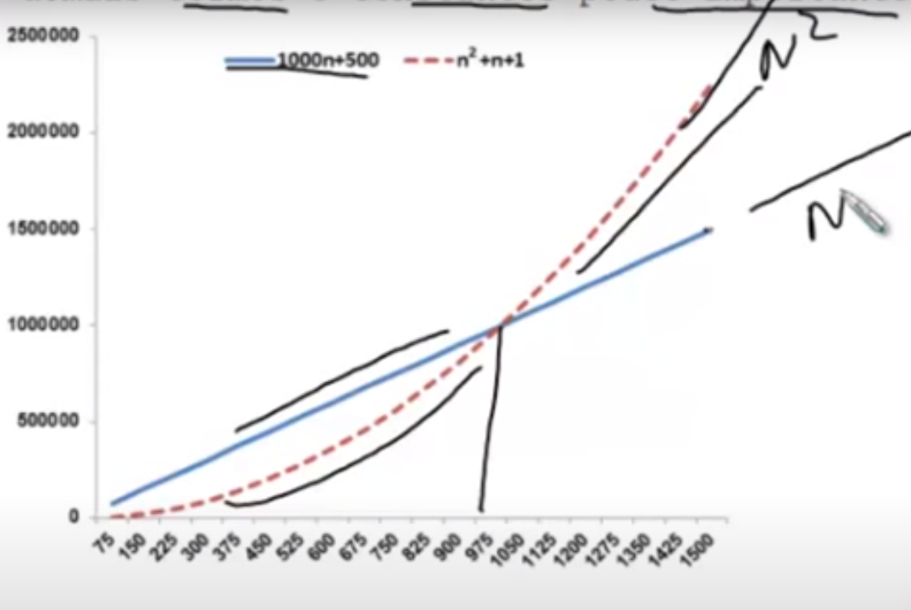

# Comportamento Assintótico

[VIDEO AULA](https://www.youtube.com/watch?v=SClFMUpBiaw&list=PL8iN9FQ7_jt6buW7SBD3yzjIp8NnJYrZl&index=3)

> Na última aula, vimos que o custo para o 
> algoritmo abaixo é dado pela função `f(n) = 4n + 3`

```java
/*1*/ int M = A[0];
/*2*/ for(i = 0; i < n; i++) {
/*3*/     if (A[i] >= M) {
/*4*/         M = A[i];
/*5*/     }
/*6*/ }
```
> Essa é uma função de complexidade de tempo. Ela nos da uma ideia do custo de execução
> do algoritmo para um problema de tamanho `n`.


## Dúvida
> Será que todos oos temos da função `f` são necessários para termos uma noção do custo?

De fato, nem todos os termos são necessários, podemos descartar certos termos da função e 
manter apenas os que nos dizem o que acontece com a função quando o tamanho dos dados de 
entrada `(n)` cresce muito.

Se um algoritmo é mais rápido do que o outro para um grande conjunto de dados de entrada,
é muito provável que ele continue sendo também mais rápido em um conjunto de dados menor.

Podemos descartar todos os termos que crescem lentamente e manter apenas os que crescem 
mais rápido à medida que o valor de `n` se torna maior.

A função, `f(n) = n + 3`, possui dois termos:
- `4n`
- `3`

O termo `3` é uma `constante de inicialização`, não se altera à medida que `n`aumenta.
Assim , nossa funçao pode ser reduzida para `f(n) = 4n`

Constantes que multiplicam o termo `n` da função também devem ser descartadas. Isso faz
sentido se pensarmos em diferentes linguagens de programação. Por exemplo,
a seguinte linha de código em Pascal

```pascal
M := A[i] // 1 etapa atribuição
```

Equivale ao seguinte código em liguagem C

```c
if (i >= 0 && i < n) { // 2 instruções de comparação
    M = A[i]; // 1 instrução de atribuição
}
```

O acesso a um elemento do array
- Pascal: 1 instrução (sem etapa de verificação)
- C: 3 instruções (etapa de verificação)


Ignorar essas constantes de multiplicação equivale a ignorar as particularidades de cada 
linguagem e compilador e analisar apenas a ideia do algoritmo.
Assim, nossa função pode ser reduzida para `f(n) = n`

Descartando todos os termos constantes e mantendo apenas o de maior crescimento,
obtemos o `comportamento assintótico`.
Trata-se do comportamento de uma função `f(n)` quando `n` tende ao infinito

Isso acontece porque o termo que possui a maior expoente domina o comportamento da 
função `f(n)` quando `n`tende ao infinito


#### Para entender melhor, considere duas funções:
- `g(n) = 1000n + 500`
- `h(n) = n^2 + n + 1`

Apesar da função `g(n)` possuir constantes maiores multiplicando seus termos,
existe um valor de `n` a partir do qual o resultado de `h(n)` é sempre maior
do que `g(n)`, tornando os demais termos e constantes pouco importantes.



Podemos então suprimir os termos menos importantes da função e considerar 
apenas o termo de maior grau. Assim, podemos descrever a complexidade usando
somente o seu custo dominante:
- `n` para a função `g(n)`
- `n²` para `h(n)`

### Exemplos

Abaixo podemos ver alguns exemplos de função de custo juntamente com 
o seu comportamento assintótico.
Se a função não possui nenhum termo multiplicado pdoe `n`,
seu comportamento assintótico é constante `(1)`.

| Função custo             | Comportamento assintótico |
|--------------------------|---------------------------|
| f(n) = 105               | f(n) = 1                  |
| f(n) = 15n + 2           | f(n) = n                  |
| f(n) = n² + 5n + 2       | f(n) = n²                 |
| f(n) = 5n² + 200n² + 112 | f(n) = n³                 |


De modo geral, podemos obter a função de custo de um programa simples
apenas contando os comandos de laços aninhados.

### Exemplos
- Algoritmo sem laço: número constante de instruçẽs
(exceto se houver recursão), ou seja, `f(n) = 1`;

- Com um laço indo de 1 a `n` será `f(n) = n` (ou seja, um conjunto
de instruções constantes antes e/ou depois do laço e um conjunto de 
instruções constante dentro do laço)

- Dois comandos de laço aninhados será `f(n) = n^2`, e  assim por diante 


